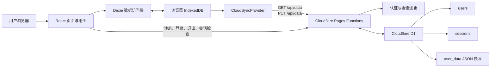
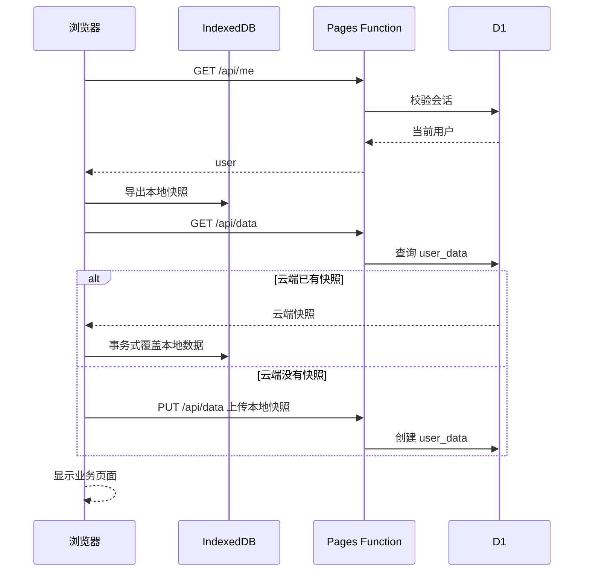

# Ownly 技术实现说明

> 本文面向需要接手、维护或继续开发 Ownly 的技术人员。阅读本文不要求事先了解项目源码，但建议具备基础的 Web、TypeScript 和数据库概念。

## 1. 项目定位

Ownly 是一个小规模自用的个人资产管理网页应用，主要解决以下问题：

- 记录个人拥有的物品及其分类、图标、购买日期、购买价格和状态。
- 记录维修、配件、退款、转卖等后续费用。
- 根据购买成本、后续费用和使用时间计算净使用成本与日均成本。
- 按状态或分类浏览、搜索和排序物品。
- 查看购入、卖出、分类资产和日均成本趋势。
- 维护心愿单，并把心愿项目转换为已购物品。
- 通过账号登录，在不同设备间同步数据。
- 同时保留浏览器本地缓存和可下载的 JSON 备份。

它不是传统的纯前端静态页面，也不是一个所有操作都直接访问服务器数据库的后台管理系统。它采用的是“本地优先 + 云端快照同步”架构：页面读写浏览器中的 IndexedDB，随后把完整数据快照同步到 Cloudflare D1。

该方案针对当前 2～3 名用户、文本与图标数据量较小的场景进行了取舍，重点是部署简单、使用成本低、弱网时仍能访问本地数据。

## 2. 总体架构



各层职责如下：

| 层次 | 主要代码 | 职责 |
| --- | --- | --- |
| 页面层 | `src/pages/`、`src/components.tsx` | 页面交互、表单、列表、图表和导航 |
| 本地数据层 | `src/db.ts` | IndexedDB 表结构、迁移、导入导出和默认分类 |
| 业务计算层 | `src/utils.ts` | 使用天数、附加费用、净成本和日均成本计算 |
| 身份认证层 | `src/auth.tsx`、`worker/auth.ts` | 登录状态、密码哈希、Cookie 和会话管理 |
| 云同步层 | `src/sync.tsx` | 初始化同步、变更监听、延迟上传和断网重试 |
| 云端接口层 | `functions/api/[[path]].ts` | API 路由、参数校验、权限校验和 D1 读写 |
| 构建部署层 | `vite.config.ts`、`scripts/`、`wrangler.toml` | Web 构建、PWA、Functions 打包和 Pages 部署 |

## 3. 技术栈及选择原因

### 3.1 React 19 + TypeScript

React 负责组件化页面，TypeScript 约束资产、分类、费用和心愿单的数据结构。项目规模不大，没有引入 Redux 等全局状态库：

- 登录状态由 React Context 管理。
- 云同步状态由另一个 React Context 管理。
- 业务数据由 Dexie 的实时查询直接驱动页面更新。
- 页面内的筛选、排序、弹窗开关等临时状态使用 `useState`。

这使项目的数据流较短，维护时不需要同时理解一套复杂的前端状态管理框架。

### 3.2 Vite

Vite 提供本地开发服务器、TypeScript 前端构建和生产资源打包。生产构建会生成带内容哈希的静态资源，输出到 `dist/`。

### 3.3 React Router

项目是单页应用，浏览器首次加载后由 React Router 在前端完成页面切换。各页面使用 `lazy` 动态导入，只有访问某个页面时才加载对应代码块。

### 3.4 Dexie + IndexedDB

IndexedDB 是浏览器内置的结构化数据库；Dexie 是它的封装库。相比 `localStorage`，IndexedDB 更适合存放多张表、执行索引查询和事务操作，也不会把所有数据限制在简单的键值字符串中。

页面使用 `dexie-react-hooks` 的 `useLiveQuery` 监听查询。当相关表发生写入后，列表和统计会自动重新计算，不需要手动刷新页面或维护一份重复的前端缓存。

### 3.5 Cloudflare Pages、Pages Functions 与 D1

- Pages 托管 React 构建后的静态资源。
- Pages Functions 运行登录和同步 API。
- D1 保存用户、会话和每个用户的业务数据快照。
- Wrangler 负责本地模拟、数据库迁移、Secret 管理和部署。

整个系统可部署在同一个 `ownly.pages.dev` 域名下。页面与 API 同源，Cookie 和来源校验都更简单。

### 3.6 Recharts、Lucide React 与 PWA

- Recharts 绘制日均趋势面积图和分类资产环形图。
- Lucide React 提供统一风格的界面图标及物品图标。
- `vite-plugin-pwa` 生成 Web App Manifest 和 Service Worker，使浏览器可以缓存静态资源并把网站安装到桌面。

## 4. 目录结构

```text
Ownly/
├─ src/
│  ├─ pages/                  # 业务页面
│  │  ├─ Home.tsx            # 首页、搜索、筛选、排序
│  │  ├─ AssetEditor.tsx     # 新增和编辑物品
│  │  ├─ AssetDetail.tsx     # 物品详情、附加费用、成本图表
│  │  ├─ Stats.tsx           # 统计分析
│  │  ├─ Wishlist.tsx        # 心愿单
│  │  ├─ Settings.tsx        # 同步、备份、清空和退出
│  │  └─ Login.tsx           # 登录与注册
│  ├─ App.tsx                # 登录门禁、同步门禁和路由
│  ├─ main.tsx               # React 入口及 Service Worker 注册
│  ├─ db.ts                  # Dexie 数据库和迁移
│  ├─ types.ts               # 核心 TypeScript 数据类型
│  ├─ utils.ts               # 成本与日期计算
│  ├─ auth.tsx               # 前端认证请求与状态
│  ├─ sync.tsx               # 云同步实现
│  ├─ components.tsx         # 布局、导航、物品卡片等公共组件
│  ├─ asset-icons.tsx        # 分类对应的物品图标目录
│  ├─ DatePicker.tsx         # 自定义日期选择器
│  ├─ SelectControl.tsx      # 自定义下拉选择器
│  ├─ App.css                # 页面和业务组件样式
│  └─ index.css              # 全局基础样式
├─ functions/api/[[path]].ts # Cloudflare Pages Functions API 总入口
├─ worker/auth.ts            # 密码与会话安全函数
├─ migrations/               # D1 数据库迁移 SQL
├─ scripts/copy-worker.mjs   # 把 Functions 构建结果放入 dist
├─ public/                   # PWA 图标和缓存响应头
├─ vite.config.ts            # Vite 与 PWA 配置
├─ wrangler.toml             # Cloudflare 项目和 D1 绑定
└─ package.json              # 依赖和开发、构建、部署命令
```

## 5. 应用启动与页面路由

浏览器加载应用后的顺序如下：

1. `src/main.tsx` 注册 Service Worker。
2. React 在 `StrictMode` 下挂载 `App`。
3. `AuthProvider` 请求 `GET /api/me`，检查当前 Cookie 是否对应有效会话。
4. 未登录时只显示登录/注册页。
5. 已登录时创建 `CloudSyncProvider`，完成当前账号第一次本地/云端同步。
6. 同步初始化结束后再显示业务路由，避免先展示旧账号的本地数据。

主要路由为：

| 地址 | 页面 | 功能 |
| --- | --- | --- |
| `/` | 首页 | 总览、搜索、筛选、排序和物品列表 |
| `/stats` | 统计 | 购入卖出、日均趋势和分类资产 |
| `/wishlist` | 心愿单 | 记录计划购买的物品 |
| `/settings` | 我的 | 同步状态、备份、恢复、清空和退出 |
| `/assets/new` | 物品编辑器 | 新增物品 |
| `/assets/:id` | 物品详情 | 详情、费用、成本趋势和删除 |
| `/assets/:id/edit` | 物品编辑器 | 编辑已有物品 |

`AppLayout` 提供桌面侧边导航/窄屏底部导航、当前用户信息以及同步状态提示。访问物品新增、编辑或详情路由时，会切换对应的页面布局样式。

## 6. 核心数据模型

类型定义集中在 `src/types.ts`。

### 6.1 Category：分类

```ts
interface Category {
  id: string
  name: string
  icon: string
  color: string
  createdAt: string
}
```

当前内置 7 个分类，顺序固定为：

1. 数码
2. 家电
3. 家居
4. 服饰穿戴
5. 办公兴趣
6. 出行
7. 其他

分类不再由用户维护。`icon` 是早期分类展示留下的兼容字段；当前主要使用分类名称与颜色，具体物品图标由资产自身的 `icon` 决定。

### 6.2 Asset：物品

```ts
interface Asset {
  id: string
  name: string
  categoryId: string
  icon: string
  purchaseDate: string
  purchasePrice: number
  status: 'using' | 'retired' | 'sold'
  retiredDate?: string
  saleDate?: string
  salePrice?: number
  notes?: string
  createdAt: string
  updatedAt: string
}
```

状态只有三种：

- `using`：使用中，使用天数持续计算到今天。
- `sold`：已售出，使用天数停在 `saleDate`。
- `retired`：已退役，使用天数停在 `retiredDate`。

`salePrice` 仍保留在数据模型与成本公式中，用于兼容直接售出金额；当前主要通过负数附加费用记录售出、退款等回款。

### 6.3 AssetExpense：附加费用

```ts
interface AssetExpense {
  id: string
  assetId: string
  name: string
  amount: number
  date: string
  notes?: string
  createdAt: string
  updatedAt: string
}
```

费用使用金额正负表达方向：

- 正数表示增加成本，例如维修、配件和保养支出。
- 负数表示抵扣成本，例如售出回款和退款。

界面中用户不需要手工输入负号，而是先选择“增加成本”或“抵扣成本”，再输入大于 0 的金额，保存时由代码转换符号。

### 6.4 WishItem：心愿项

心愿项记录名称、分类、预计价格及优先级。优先级为 `high`、`medium`、`low`，界面分别显示为“很想要”“想一想”“随缘”。

转换为已购时，代码在同一个 IndexedDB 事务中创建物品并删除心愿项，避免只完成其中一步。

## 7. 本地数据库与数据迁移

本地数据库名为 `ownly-database`，包含以下表：

| 表 | 主要索引 | 内容 |
| --- | --- | --- |
| `assets` | `id`、`name`、`categoryId`、`status`、`purchaseDate`、`createdAt` | 物品 |
| `categories` | `id`、`name`、`createdAt` | 分类 |
| `wishes` | `id`、`name`、`categoryId`、`priority`、`createdAt` | 心愿单 |
| `expenses` | `id`、`assetId`、`date`、`createdAt` | 附加费用 |

Dexie 当前 schema 版本为 6。历史升级逻辑仍保留在 `src/db.ts`，已有用户升级网页后，浏览器会自动执行对应迁移：

- 删除早期物品图片字段，改为内置图标。
- 删除收藏字段。
- 把旧状态 `stored` 迁移为 `using`。
- 增加附加费用表。
- 补齐并重新排列默认分类。
- 校正物品图标，使其与所属分类一致。

不要随意删除旧版本迁移。即使新安装只会直接创建最新结构，旧浏览器里可能仍存在早期数据库，需要这些迁移才能无损升级。

### 7.1 响应式读取

页面通常采用以下模式：

```ts
const assets = useLiveQuery(() => db.assets.toArray(), []) ?? []
```

写入 `db.assets` 后，Dexie 会使相关查询重新执行，React 随之重新渲染。这就是新增费用或修改物品后首页、详情和统计自动更新的基础。

### 7.2 本地导入导出

`exportData()` 生成版本为 2 的完整快照：

```text
categories + assets + wishes + expenses
```

`importData()` 会先校验四组数组，再在单个 Dexie 事务中清空并恢复全部表。旧备份如果没有 `expenses`，会按空数组处理。

“我的”页面可把快照下载为 JSON，也可以从 JSON 恢复。JSON 备份同时也是云同步的基本数据格式。

## 8. 物品分类与图标联动

图标目录集中在 `src/asset-icons.tsx`，按 7 个分类维护。每个图标包含：

- 稳定的字符串 key，用于保存到数据库。
- 中文名称，用于图标选择器展示。
- 对应的 Lucide React 图标组件。

新增或编辑物品时：

1. 用户先选择分类。
2. 分类变化后，物品图标切换到该分类的默认图标。
3. 图标选择器只显示当前分类的图标。
4. 保存或读取旧数据时，`normalizeAssetIcon()` 会再次校验图标是否属于当前分类。
5. 不合法或已失效的图标会回退到该分类默认图标。

以后增加图标时，应优先修改这个集中目录，不要在不同页面分别维护图标列表。

## 9. 成本与日期计算

成本规则集中在 `src/utils.ts`，避免首页、详情页和统计页各写一套互相不一致的公式。

### 9.1 使用天数

```text
使用中：购买日期 → 今天
已售出：购买日期 → 售出日期
已退役：购买日期 → 退役日期
```

开始日和结束日都计入，因此购买当天的使用天数是 1，而不是 0：

```text
使用天数 = floor((结束日 - 购买日) / 1天) + 1
```

### 9.2 净使用成本

```text
附加费用合计 = 当前物品全部 AssetExpense.amount 之和

净使用成本 = max(
  0,
  购买价格 + 附加费用合计 - salePrice
)
```

最外层使用 `max(0, ...)`，因此退款或回款超过总支出时，成本显示为 0，不会出现负的使用成本。

### 9.3 日均成本

```text
日均成本 = 净使用成本 / 使用天数
```

例如：

```text
购买价格：¥6,000
维修支出：+¥500
售出回款：-¥2,000
使用天数：900 天

净使用成本 = 6,000 + 500 - 2,000 = ¥4,500
日均成本 = 4,500 / 900 = ¥5/天
```

### 9.4 “总资产”的实际含义

首页“总资产”目前计算的是所有物品的净使用成本合计，并非物品当前市场估值：

```text
总资产 = Σ 每件物品的净使用成本
总日均 = Σ 每件物品的日均成本
```

如果将来要表达二手市场价值，应新增“当前估值”字段和独立统计，不应复用现有净成本。

## 10. 各页面实现

### 10.1 首页

首页同时读取物品、附加费用和分类。主要功能包括：

- 展示总资产和总日均。
- 按物品名称进行不区分大小写的搜索。
- 在“按状态”和“按分类”两种视图间切换。
- 状态筛选支持全部、使用中、已售出、已退役。
- 分类筛选根据内置分类动态生成。
- 支持金额、使用天数、购买日期和日均成本排序。
- 再次选择当前排序项时，在升序和降序间切换。

“金额排序”和物品卡片显示的金额都使用净使用成本，与首页总资产保持同一口径。附加费用或售出回款发生变化后，卡片金额和排序结果会自动更新。

### 10.2 新增/编辑物品

新增和编辑共用 `AssetEditor`：

- 名称不能为空。
- 购买日期必填，不能晚于今天。
- 购买价格必须是有限数字且大于 0。
- 已售出/已退役必须记录状态日期。
- 状态日期必须在购买日期和今天之间。
- 分类变化时同步更新可选图标。
- 名称最长 40 个字符，备注最长 500 个字符。

保存使用 `put`，因此同一套逻辑可新增或覆盖指定 ID 的物品。新 ID 优先使用 `crypto.randomUUID()` 生成。

### 10.3 物品详情与附加费用

详情页展示状态、分类、使用天数、购买信息、费用列表和日均成本图表。

附加费用按日期和创建时间倒序排列。新增费用时校验：

- 费用名称必填。
- 输入金额必须大于 0。
- 费用日期必须在购买日期和今天之间。

删除物品时，代码在一个事务中先删除该物品的费用，再删除物品本身，防止产生孤立费用记录。

详情页日均曲线选取最多 7 个时间点，用“当前净使用成本 ÷ 当时使用天数”展示成本随使用时间摊薄的直观效果。它是展示性曲线，不是逐日记账流水。

### 10.4 统计页

统计范围支持周、月、年和全部：

- 购入金额 = 范围内购买的物品原价 + 范围内正数附加费用。
- 卖出金额 = 范围内直接售出金额 + 范围内负数附加费用绝对值。
- 购入/卖出件数按物品购买日期和售出日期统计。
- 日均总计使用当前全部物品的日均成本。
- 日均趋势抽取 7 个时间点，并只纳入对应日期前已经发生的费用。
- 分类资产环形图按每件物品的净使用成本汇总，与首页总资产口径一致。

因此时间范围会影响购入卖出和趋势数据，但“当前总日均”表达的是当前全量状态。

### 10.5 心愿单

心愿单记录预计价格、分类与优先级，可删除或转为已购。转换操作会：

1. 根据心愿项创建一件“使用中”的物品。
2. 购买日期设为今天。
3. 购买价格采用预计价格。
4. 使用分类默认图标。
5. 删除原心愿项。

### 10.6 我的/设置

设置页提供：

- 当前账号与物品数量。
- 云同步状态和最后同步时间。
- 手动“立即同步”。
- 导出 JSON 备份。
- 从 JSON 备份恢复。
- 清空本地业务数据并恢复默认分类。
- 退出当前账号。

导入、清空等本地变更也会被同步监听捕获，随后上传新快照。

## 11. 自定义表单控件

项目没有直接使用浏览器原生下拉框和日期框，而是实现了两个可复用控件，以保持桌面端视觉一致。

### 11.1 SelectControl

自定义下拉框支持：

- 当前选中项和勾选标记。
- 点击组件外部关闭。
- 失去焦点关闭。
- `ArrowUp`、`ArrowDown`、`Home`、`End` 键盘导航。
- `Escape` 关闭并把焦点还给触发按钮。
- `listbox`、`option` 和 `aria-selected` 等无障碍属性。

新增选择项时只需提供 `{ value, label }[]`，不应复制一套新的下拉框。

### 11.2 DatePicker

自定义日期选择器支持：

- 直接选择年份和月份，不必逐月翻页。
- 上一月、下一月快捷按钮。
- 42 格日历视图，同时显示相邻月份日期。
- 今天与已选日期高亮。
- `min`、`max` 日期边界。
- 点击外部、失焦或按 `Escape` 关闭。

日期在数据库中统一保存为本地日期字符串 `YYYY-MM-DD`，用于比较时可直接按字符串排序。

## 12. 登录、密码与会话

### 12.1 API

所有接口都位于同一个 Pages Function 中：

| 方法 | 地址 | 是否登录 | 作用 |
| --- | --- | --- | --- |
| `POST` | `/api/register` | 否 | 使用注册码创建账号并建立会话 |
| `POST` | `/api/login` | 否 | 校验密码并建立会话 |
| `POST` | `/api/logout` | 是/可匿名调用 | 删除当前会话并清除 Cookie |
| `GET` | `/api/me` | 否 | 返回当前登录用户或 `null` |
| `GET` | `/api/data` | 是 | 读取当前用户云端快照 |
| `PUT` | `/api/data` | 是 | 覆盖当前用户云端快照 |

### 12.2 注册限制

- 用户名长度为 3～32 个字符。
- 可使用中文、字母、数字、点、横线和下划线。
- 用户名在 D1 中不区分大小写且唯一。
- 密码长度为 8～128 个字符。
- 注册必须匹配 Cloudflare Secret `REGISTRATION_CODE`。

注册码只用于限制谁能创建账号，不参与后续登录，也不能代替用户密码。它不应写入源码、`.env` 或 Git 历史。

#### 注册码存放与管理

线上注册码保存在 Cloudflare 的 `ownly` Pages 项目配置中，类型为加密 Secret。它不在 Git 仓库、`wrangler.toml`、D1 数据库或浏览器中。Pages Function 运行时由 Cloudflare 将其注入为：

```ts
env.REGISTRATION_CODE
```

在 Cloudflare Dashboard 中可按以下路径找到变量名：

```text
Workers & Pages → ownly → Settings → Variables and Secrets → Production
```

控制台只会显示 `REGISTRATION_CODE` 这个名称，不会重新显示已保存的明文值。可用以下命令列出 Secret 名称：

```powershell
npx wrangler pages secret list --project-name ownly
```

修改线上注册码时执行：

```powershell
npx wrangler pages secret put REGISTRATION_CODE --project-name ownly
npm run deploy
```

第一条命令会交互式要求输入新值，避免注册码出现在终端历史中；重新部署确保生产 Functions 使用新 Secret。生效后旧注册码不能再注册新用户，但已有用户、密码、会话和业务数据不受影响。

本地联调使用项目根目录中不会提交到 Git 的 `.dev.vars`：

```text
REGISTRATION_CODE=本地测试注册码
```

`.dev.vars` 只供 `wrangler pages dev` 使用，与线上 Pages Secret 相互独立。

### 12.3 密码保存

服务器不会保存明文密码，而是：

1. 为每个用户生成 16 字节随机 salt。
2. 使用 PBKDF2-SHA256 派生密码哈希。
3. 迭代次数为 100,000 次。
4. 只把 salt 和哈希写入 `users` 表。

登录时用相同参数重新派生，再使用恒定时间比较，降低基于比较耗时推测内容的风险。

### 12.4 会话

登录成功后：

1. 服务器生成 32 字节随机 Token。
2. 浏览器 Cookie 保存原始 Token。
3. D1 的 `sessions` 表只保存 Token 的 SHA-256 哈希。
4. 请求到达服务器时，再对 Cookie Token 哈希并查询会话。

Cookie 属性为：

```text
HttpOnly; Secure; SameSite=Strict; Path=/; Max-Age=30天
```

- `HttpOnly`：前端 JavaScript 无法读取 Token。
- `Secure`：只通过 HTTPS 发送。
- `SameSite=Strict`：减少跨站请求携带 Cookie。
- 会话有效期为 30 天。

### 12.5 管理员人工重置密码

项目提供 `scripts/reset-password.mjs`，用于用户忘记密码时由管理员在本机重置。该能力不是 HTTP API，不会在公网暴露管理员入口；管理员凭证是本机 Wrangler 已登录的 Cloudflare 账号。

线上重置命令为：

```powershell
npm run admin:reset-password -- --remote
```

脚本的安全处理包括：

- 必须明确指定 `--remote` 或 `--local`，防止混淆线上和本地 D1。
- 新密码只能在交互式终端中输入并以星号遮挡，不接受密码命令行参数。
- 线上操作必须额外输入 `RESET` 确认。
- 使用与登录系统相同的 PBKDF2-SHA256 参数重新生成随机 salt 和密码哈希。
- 临时 SQL 文件写入系统临时目录，并在成功或失败后删除。
- 更新密码后删除该用户的全部会话，使所有设备必须重新登录。

这个脚本是管理员兜底能力，不等同于用户自助找回密码。它不需要新增 D1 字段，也不需要重新部署 Pages。

#### Wrangler 管理员凭证

这里的“管理员凭证”不是 Ownly 管理员账号、注册码或数据库密码，而是 Cloudflare 账号授权给 Wrangler 的 OAuth 凭证。执行：

```powershell
npx wrangler login
```

Wrangler 会打开浏览器，用户登录 Cloudflare 并同意授权后，OAuth 凭证保存在当前操作系统用户的 Wrangler 配置目录中。此后重置脚本调用 Wrangler，Wrangler 使用该凭证请求 Cloudflare D1 API；Cloudflare 根据账号是否拥有 `ownly-db` 权限决定是否允许操作。

```text
reset-password.mjs
        ↓
本机 Wrangler OAuth 凭证
        ↓
Cloudflare 权限校验
        ↓
ownly-db
```

`wrangler.toml` 中的 `database_id` 只是定位数据库，不是访问凭证。仅获得源码和数据库 ID 的人无法修改线上 D1。注册码同样不能换取 D1 管理权限。

更换开发电脑时不需要复制旧电脑上的 OAuth 文件，推荐在新电脑重新授权：

```powershell
git clone https://github.com/Jim-0621/Ownly.git
cd Ownly
npm install
npx wrangler login
npx wrangler whoami
```

`whoami` 用于确认当前登录的是拥有 Ownly 项目的正确 Cloudflare 账号。确认后即可执行：

```powershell
npm run admin:reset-password -- --remote
```

真正需要长期保管的是 Cloudflare 登录账号、密码、两步验证设备和恢复码。旧电脑丢失或不再使用时，应在 Cloudflare 侧撤销旧的 Wrangler/OAuth 授权，并在新电脑重新登录。不要把本机 OAuth 文件复制进项目或提交到 Git。

自动化环境也可以使用权限受限的 Cloudflare API Token，但当前人工重置场景优先使用交互式 `wrangler login`，避免额外保存长期 Token。

## 13. 云同步机制

### 13.1 首次同步



规则可以概括为：

- 云端有数据：以云端为准，覆盖浏览器本地快照。
- 云端无数据：把当前浏览器本地快照作为账号的初始数据。
- 检测到浏览器此前属于另一个用户时，先清空本地数据，避免账号串数据。

### 13.2 自动上传

初始化完成后，`useLiveQuery(() => exportData())` 监听四张业务表。发生变化时：

1. 等待 700ms，合并短时间内连续发生的修改。
2. 生成忽略 `exportedAt` 的内容指纹。
3. 内容没有变化则不上传。
4. 上传任务进入 Promise 队列，串行执行，避免旧请求晚于新请求完成。
5. 成功后记录同步时间和最新内容指纹。
6. 失败时显示错误或离线状态。
7. 浏览器恢复网络后，使用最新本地快照重试。

“立即同步”会清除上一次内容指纹，强制上传当前快照。

### 13.3 当前冲突策略

当前同步单位是“账号的整份快照”，策略是最后一次成功写入覆盖：

```text
user_data[user_id] = 最新完整 JSON
```

系统没有字段级合并、版本冲突拒绝或操作日志。因此：

- 非常适合少量用户、每个账号通常只有一台活跃设备的场景。
- 不建议同一账号在两台设备上同时离线编辑。
- 后上传的完整快照可能覆盖另一台设备的更改。
- D1 的 `version` 会递增，但前端当前没有用它做乐观锁。

若以后需要多人协作或多设备并发，应把物品和费用拆成云端明细表，并按记录的 `updatedAt` 或版本号进行增量同步与冲突处理。

## 14. D1 数据库设计

迁移文件 `migrations/0001_cloud_sync.sql` 创建三张表。

### 14.1 users

保存账号本身：

```text
id, username, password_hash, password_salt, created_at
```

### 14.2 sessions

保存登录会话：

```text
token_hash, user_id, expires_at, created_at
```

`user_id` 关联 `users`，用户删除后会级联删除会话。过期时间有索引，登录时会顺便清理已过期会话。

### 14.3 user_data

保存业务数据：

```text
user_id, payload, version, updated_at
```

每个用户最多一行，`payload` 是完整 JSON 快照，而不是把资产、费用和心愿单分别拆成 D1 表。

这样设计的优点是接口和同步逻辑简单、事务边界清楚、适合小数据量。缺点是无法高效地在服务器端查询单件物品，也不适合大数据或高并发协作。

## 15. 服务端校验与安全边界

服务端目前包含以下保护：

- 所有响应使用 `Cache-Control: no-store`，避免缓存账号数据。
- 注册、登录、退出和写入数据检查请求来源是否同源。
- 所有 D1 SQL 使用参数绑定，避免字符串拼接注入。
- API 请求正文最多 750,000 个字符。
- 同步快照必须包含分类、物品和心愿数组，费用必须是数组或省略。
- 兼容旧图片字段时，只接受合法 Base64 图片且单张不超过 10KB。
- 未登录不能读取或写入用户数据。
- 数据查询始终使用当前会话的 `user.id`，客户端不能指定其他用户 ID。
- 未预期异常只向前端返回“服务器处理失败”，详细错误写入服务端日志。

需要正确理解当前边界：

- 快照校验主要检查顶层结构，还没有逐字段验证每一件资产的完整类型。
- 750,000 限制按 JavaScript 字符串长度判断，并非严格的网络字节数。
- 数据在 HTTPS 连接中加密传输，D1 中的业务快照本身不是应用层加密密文。
- 系统没有用户自助找回/修改密码、管理员后台、登录限流和多因素认证；忘记密码只能由具备 Cloudflare 权限的管理员通过本机脚本重置。
- 当前适合私人、小范围使用，不应未经加固直接作为公开多租户产品。

## 16. PWA 与缓存策略

PWA 配置包含中文应用名、主题色、192/512 图标和 `standalone` 显示模式。Service Worker 使用 `autoUpdate`，页面启动时立即注册。

`public/_headers` 的缓存策略为：

- 根页面、`index.html`、Service Worker 和 Manifest 不缓存或必须重新验证，便于及时发现新版本。
- 带构建哈希的 `/assets/*` 静态资源缓存一年并标记 `immutable`。

这种组合使新部署能被较快发现，同时避免重复下载没有变化的 JS/CSS 文件。

PWA 可以让网页被安装成类似应用的窗口，但它本质上仍运行在浏览器内核中。当前项目已按用户实际需求主要优化为桌面网页，PWA 能力属于额外保留能力。

## 17. 构建与部署

### 17.1 开发命令

只开发页面样式和本地业务功能：

```powershell
npm install
npm run dev
```

该模式只有 Vite，不提供真实的 Pages Functions 和 D1，因此登录、注册、云同步不能完整联调。

联调登录与同步：

```powershell
npm run dev:cloud
```

它会先完整构建，再由 Wrangler 启动 `dist`，并连接本地模拟的 D1。项目根目录需要准备未提交到 Git 的 `.dev.vars`：

```text
REGISTRATION_CODE=仅用于本地测试的注册码
```

### 17.2 完整构建

```powershell
npm run build
```

实际执行链为：

```text
npm run build
├─ npm run build:web
│  ├─ tsc -b
│  └─ vite build
├─ npm run typecheck:functions
│  └─ tsc -p functions/tsconfig.json
└─ npm run build:functions
   ├─ wrangler pages functions build ...
   └─ node scripts/copy-worker.mjs
```

最后一步把 Wrangler 生成的 Functions Worker 复制为：

```text
dist/_worker.js
```

因此 `dist` 同时包含前端静态资源和云端 API Worker，不能只执行 Vite 构建后就认为生产包完整。

### 17.3 部署

```powershell
npm run deploy
```

`deploy` 已经先调用 `npm run build`，不需要提前重复构建。随后执行：

```text
wrangler pages deploy dist --project-name ownly --branch production
```

部署到生产分支后，稳定访问地址为：

```text
https://ownly.pages.dev
```

Wrangler 同时输出的带随机前缀地址是本次部署的预览地址，适合确认某个具体版本；日常使用稳定域名即可。

### 17.4 数据库迁移与 Secret

本地 D1 迁移：

```powershell
npm run db:migrate:local
```

远程 D1 迁移：

```powershell
npm run db:migrate:remote
```

线上注册码通过交互命令设置，不写进代码：

```powershell
npx wrangler pages secret put REGISTRATION_CODE --project-name ownly
```

## 18. 日常修改后的推荐流程

```powershell
# 1. 本地开发
npm run dev

# 2. 静态检查
npm run lint

# 3. 完整生产构建
npm run build

# 4. 确认无误后部署；deploy 会再次完整构建
npm run deploy
```

如果已经确定直接部署，可以只执行 `npm run deploy`。单独运行 `npm run build` 的意义主要是部署前先在本地发现类型、构建或 Functions 打包错误。

改动涉及数据库结构时，应先新增迁移文件并分别验证本地、远程迁移；不要直接修改已在线上执行过的旧迁移文件。

## 19. 已知限制与后续扩展方向

### 19.1 当前限制

- 云同步为整份 JSON 最后写入覆盖，没有冲突合并。
- 业务数据未做应用层加密，Cloudflare D1 管理侧可以读取快照。
- 没有用户自助密码修改/找回、账号删除和管理员界面，仅提供本机管理员重置脚本。
- 没有操作历史或误删恢复；删除前应保留 JSON 备份。
- D1 不能直接按资产、费用维度做服务端统计，因为业务数据保存在 JSON 中。
- 统计和详情曲线适合个人概览，不是会计账簿或严格现金流报表。
- “总资产”是净使用成本，并非当前市场估值。

### 19.2 建议的扩展优先级

如果继续开发，建议按以下顺序考虑：

1. 增加用户自助修改密码、注销其他会话和账号删除。
2. 为同步加入版本号条件更新，至少在覆盖前提示冲突。
3. 为 JSON 快照增加严格的逐字段 schema 校验。
4. 增加自动或定期历史快照，提供误删恢复。
5. 明确“成本”“现金流”“当前估值”三套口径，避免统计名称混淆。
6. 用户与数据量增加后，再把资产、费用、心愿拆成 D1 明细表。
7. 需要隐私增强时，在浏览器端用用户密钥加密业务快照后再上传。

不要仅为了“看起来更像大型项目”而提前引入复杂后端。当前快照方案与项目规模是匹配的，只有并发、查询、容量或安全要求真正变化时才值得迁移。

## 20. 新开发者建议阅读顺序

第一次接手时，建议按以下顺序阅读：

1. `src/types.ts`：先理解项目保存哪些数据。
2. `src/utils.ts`：理解使用天数、净成本和日均成本口径。
3. `src/db.ts`：理解本地表、默认分类、迁移和备份格式。
4. `src/App.tsx`、`src/components.tsx`：理解应用门禁、路由和整体布局。
5. `src/pages/Home.tsx`、`AssetEditor.tsx`、`AssetDetail.tsx`：理解核心业务闭环。
6. `src/pages/Stats.tsx`：核对各项统计口径。
7. `src/auth.tsx`、`worker/auth.ts`：理解登录、密码和 Cookie。
8. `src/sync.tsx`：理解本地与云端如何协调。
9. `functions/api/[[path]].ts`、`migrations/0001_cloud_sync.sql`：理解服务端接口和 D1。
10. `package.json`、`vite.config.ts`、`wrangler.toml`：最后理解构建和部署。

## 21. 一句话理解 Ownly

Ownly 的核心不是“每次点击都请求云端数据库”，而是：

> React 界面实时读取浏览器 IndexedDB，统一业务函数负责成本计算，Cloudflare Pages Functions 负责账号与权限，D1 为每个用户保存一份可跨设备恢复的完整数据快照。

理解这句话，就理解了整个项目最重要的技术设计。
